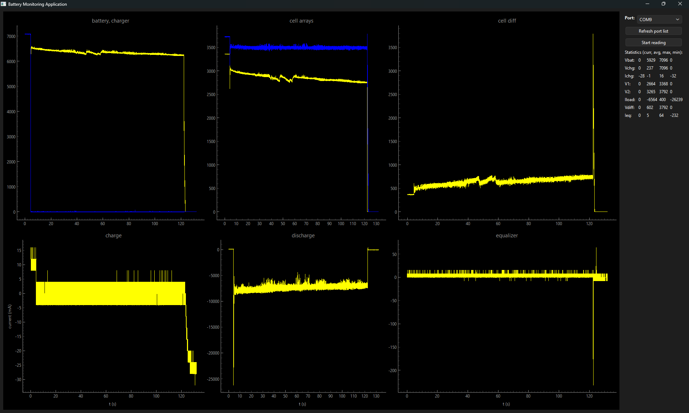

# Battery Monitoring Application

An application having a PyQt/PyQtGraph based graphical user interface (GUI) to read, process, visualize and calculate statistics of voltage and current sensor data (INA3221, Arduino/ESP32).

## Installation

Since the wheel file is hosted at TestPyPI for the time being and dependencies are outdated (at TestPyPI), first install without installing dependencies (**--no-deps**)

> python -m pip install **--no-deps** -i https://test.pypi.org/simple/ battery-monitor-app-amfd

and then install the dependencies from the default package index (PyPI) using the requirements.txt file

> python -m pip install -r requirements.txt

## Usage

To run the application

> python -m battery_monitoring_app_amfd.run

or in a script

> import sys
> 
> from battery_monitoring_app_amfd import BatMonApp
>
> if \_\_name__ == '\_\_main__':
> 
>     app = BatMonApp(sys.argv) # or an empty list instead of sys.argv
>
>     app.exec()

Select a serial port in the drop-down list to read from. Press the 'Refresh port list' button if the serial port corresponding to the microcontroller board is not showing.

Start and stop reading data from the chosen serial port by pressing the 'Start reading' (then 'Stop reading') button. Data stored and shown is reset when data reading is restarted.

The plots are drawn and statistics are calculated automatically for the data read so far.

")